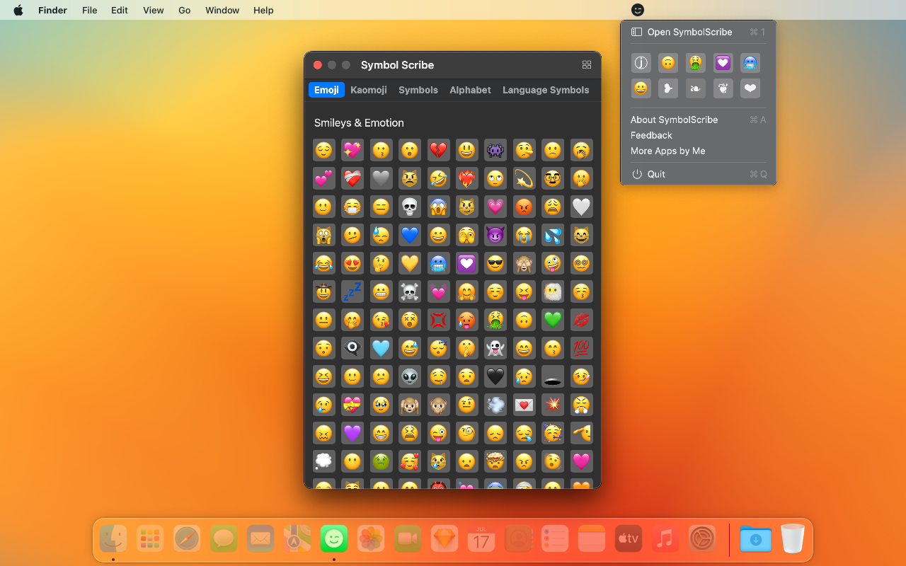
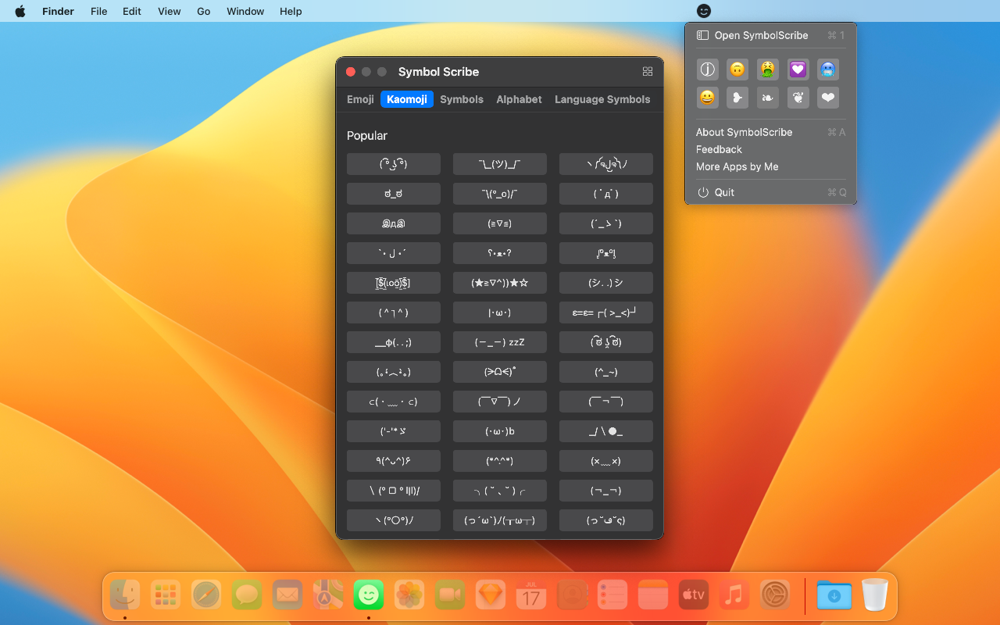
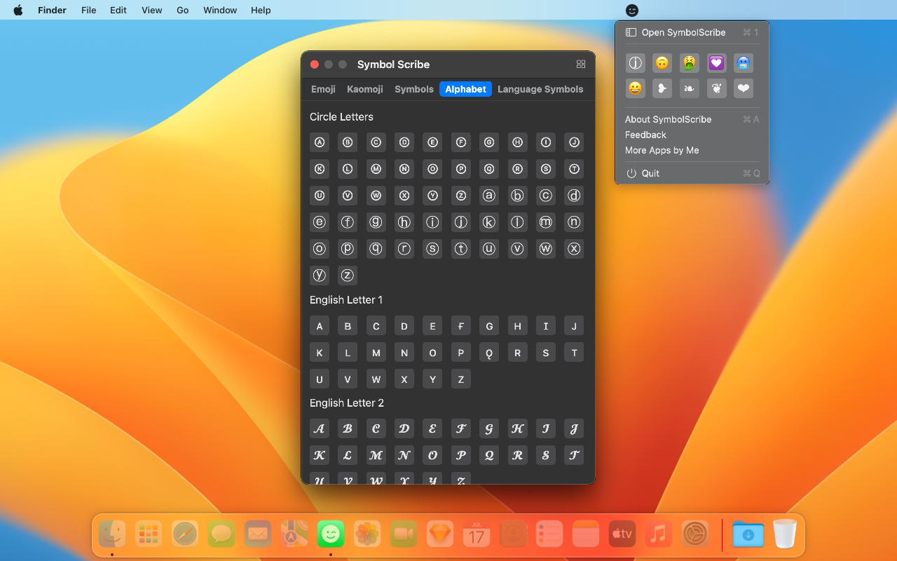

	 
	 
	
  

		<a href="./README.zh.md">中文</a> • 
    <a target="_blank" href="https://apps.apple.com/app/symbol-scribe/id6470879005">AppStore</a> • 
		<a target="_blank" href="https://wangchujiang.com/#/contact">Contact & Support</a>
  

	<h1>Symbol Scribe</h1>
  <!--rehype:style=border: 0;-->
  

    
  

In messaging applications, use interesting emoji emoticons such as smiley faces, kaomojis, and various other symbols.

Have you ever seen people using funny emoji emoticons in SMS, Facebook, Twitter, email applications, and various other messaging platforms? These include emojis, kaomojis, and various other symbols.