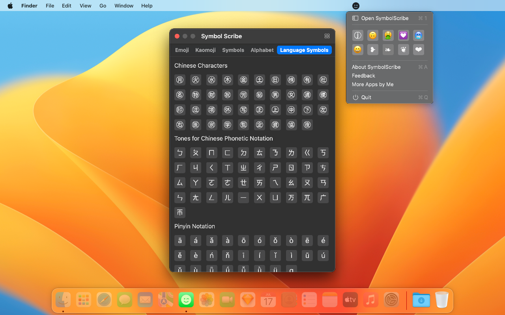

	 
	 
	
	<h1>Symbol Scribe</h1>
  <!--rehype:style=border: 0;-->
  

		<a href="./README.md">English</a> • 
    <a target="_blank" href="https://apps.apple.com/app/symbol-scribe/id6470879005">AppStore</a> • 
		<a target="_blank" href="https://wangchujiang.com/#/contact">联系&支持</a> • 
    <a target="_blank" href="https://github.com/jaywcjlove/symbol-scribe/releases">变更日志</a>
  

  

    
  

消息应用中使用有趣的表情符号，如笑脸表情符号、颜文字和其他各种符号。

你是否曾经看到人们在短信、Facebook、Twitter、电子邮件应用和各种其他消息平台上使用有趣的表情符号？这些包括表情符号、颜文字和各种其他符号。